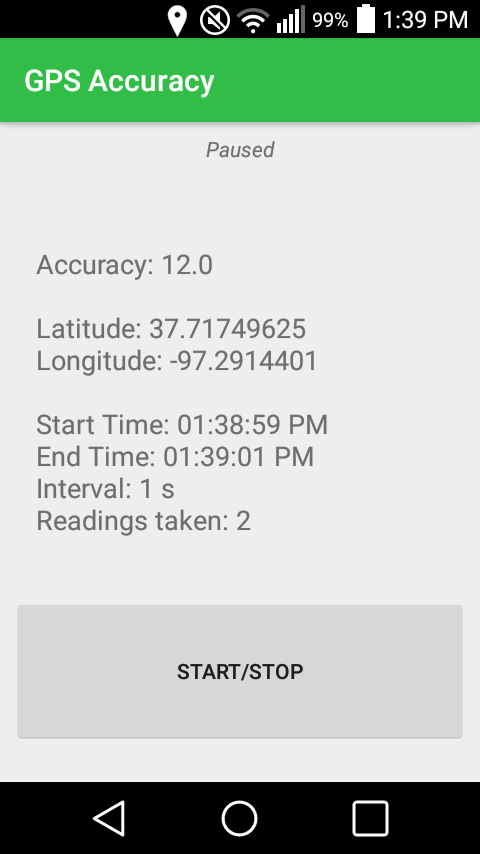

# GPS_Accuracy
## Purpose
Shows the accuracy value of the GPS readings according Android's built-in getAccuracy() function. 
This built-in Android function is not perfect, but tends to give decent approximations as to the the error 
radius of the GPS readings. More information about the getAccuracy() function can be found 
<a href="https://developer.android.com/reference/android/location/Location#getAccuracy()">here</a>.
## User Inputs
At startup,  the user is able to input the desired GPS refresh rate in seconds. (An input of 0 will cause the location to update as fast as possible, but this is not recommended due to high power consumption). Once this input is given, the app begins collecting data. The user can then press the START/STOP button to stop the data collection and display more detailed info.
## Information given by the app
While running:
* Accuracy reading from getAccuracy function
* Latitude
* Longitude
* Start time
* Time of first GPS reading
While stopped, it also shows:
* Stop time
* Inputted update interval
* Number of readings taken
## Screenshot in stoppped mode

## Compatibility
Android 4.0 Ice Cream Sandwich and up
